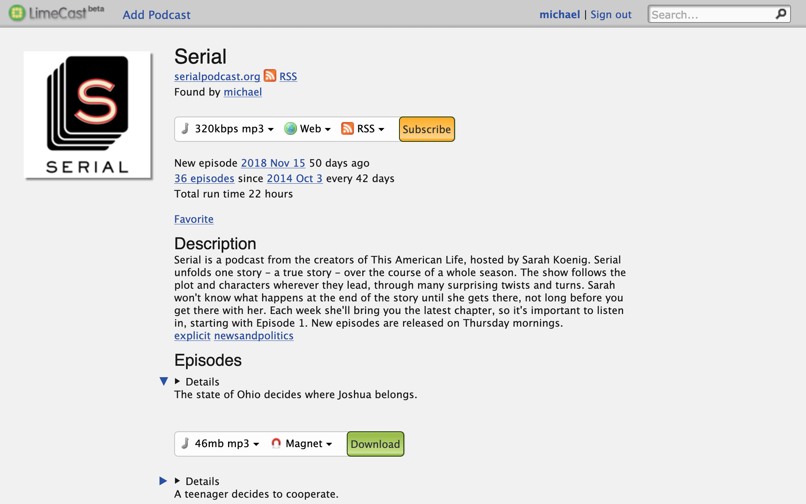

# LimeCast

The web's open podcast directory and archive

*Note: This service and code are both deprecated and are here for historical purposes. Rails 2 is missing many, many security fixes and is not safe to run in production. You have been warned.*



## Prerequisites

* Docker

## Installation

Build the container:

```bash
docker build -t limecast .
```

Set up the database:

```bash
docker run --rm -it -v $(pwd)/db/data/:/db limecast rbenv exec rake db:create:all
docker run --rm -it -v $(pwd)/db/data/:/db limecast rbenv exec rake db:schema:load
```

## Usage

```bash
docker run --init --rm -it -v $(pwd)/db/data/:/db -p 3000:3000 limecast
```

If you want to serve on a different port, change the first `3000` to something else.
